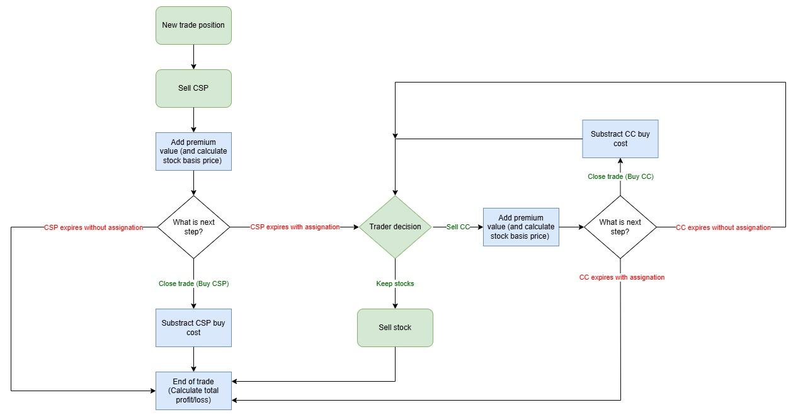

# Financial Strategy Tracker

A Streamlit desktop web application for tracking options trading strategies,
starting with the **Wheel Strategy** — a cycle of selling cash-secured puts (CSP),
accepting assignment, selling covered calls (CC) on the shares, and restarting when
the shares are called away.



---

## Features

- Manual trade entry and editing
- Full position recalculation from trade history (cost basis, premium collected, fees)
- Assignment and covered call lifecycle tracking
- Dividend recording with cost basis adjustment
- Interactive Brokers CSV import
- Dashboard with weekly/monthly premium summaries and charts
- Strategy-agnostic plugin architecture — new strategies can be added without
  touching shared infrastructure

---

## Requirements

- Python 3.11+
- Dependencies: `streamlit`, `pandas`, `plotly`, `openpyxl`

---

## Setup

```bash
# Create and activate a virtual environment (recommended)
python -m venv .venv
.venv\Scripts\activate        # Windows
source .venv/bin/activate     # macOS / Linux

# Install dependencies
pip install -r requirements.txt
```

---

## Running the app

```bash
streamlit run app.py
```

The app opens at `http://localhost:8501`. The SQLite database is created
automatically at `data/tracker.db` on first run.

---

## Running the tests

```bash
pytest
```

---

## Project structure

```
financial-strategy-tracker/
├── app.py                          # Entry point — wires pages together
├── config.py                       # Paths (DATA_DIR, DB_NAME)
├── constants.py                    # App-wide constants and enums (TradeAction, SHARES_PER_CONTRACT)
├── models.py                       # Dataclasses: Trade, Position, Assignment, Dividend, ...
├── database.py                     # SQLite schema initialisation
├── repository.py                   # All database access (no SQL outside this file)
├── calculations.py                 # Shared pure math (premium, DTE, dividends)
├── engine.py                       # Plugin registry + recalculation orchestration
├── strategies/
│   ├── base.py                     # StrategyPlugin abstract base class
│   └── wheel/
│       ├── engine.py               # Wheel state machine
│       └── calculations.py        # Wheel-specific math
├── importers/
│   ├── ib_importer.py              # Top-level IB CSV parser
│   └── wheel/
│       └── ib_importer.py         # Wheel-specific IB row parser
├── charts/
│   └── premium_charts.py          # Plotly chart builders
├── views/
│   ├── dashboard.py               # Dashboard page
│   ├── trades.py                  # Trades page
│   ├── add_trade.py               # Add Trade page
│   ├── import_trades.py           # Import page
│   └── strategies/
│       └── wheel/
│           ├── positions.py       # Positions & position management page
│           ├── assignments.py     # Assignments ledger page
│           ├── covered_calls.py   # Covered calls lifecycle page
│           └── dividends.py       # Dividends page
├── tests/
│   ├── test_calculations.py
│   ├── test_repository.py
│   └── strategies/
│       └── test_wheel_engine.py
├── data/                           # SQLite database (git-ignored)
├── requirements.txt
├── VERSION
└── REQUIREMENTS.md
```

---

## Architecture

The app is built in strict layers — each layer may only import from layers below it:

```
config / constants
    └── models
        └── database
            └── repository
                └── engine / strategies
                    └── views
                        └── app.py
```

Key rules:
- All SQL lives in `repository.py`. No SQL elsewhere.
- All business logic lives in `engine.py` and `strategies/*/engine.py`. No logic in views.
- `calculations.py` and all engine functions are pure (no side effects), making them
  straightforward to unit test.
- Each strategy is fully self-contained in `strategies/<name>/`. Adding a new strategy
  only requires creating the plugin and adding one entry to `STRATEGY_PLUGINS` in
  `engine.py`.

---

## Windows installer

A self-contained Windows installer (no Python required on the target machine) can be
built using PyInstaller + Inno Setup:

```bash
# Bundle the app
pyinstaller financial_tracker.spec

# Build the installer
iscc installer.iss
```

Output: `Output\FinancialStrategyTracker-Setup-<version>.exe`

The database is stored at `%APPDATA%\FinancialStrategyTracker\data\tracker.db` when
running from the installer, so it is never overwritten or deleted on upgrade or uninstall.

---

## Wheel strategy state machine

| Event | From | To |
|---|---|---|
| Sell CSP | `CSP` | `CSP` |
| CSP expires unassigned | `CSP` | `CSP` |
| CSP expires assigned | `CSP` | `COVERED CALLS` |
| Keep shares | `COVERED CALLS` | `READY FOR CC` |
| Sell CC | `READY FOR CC` | `CC OPEN` |
| CC expires unassigned | `CC OPEN` | `READY FOR CC` |
| CC expires assigned (called away) | `CC OPEN` | `CSP` |
